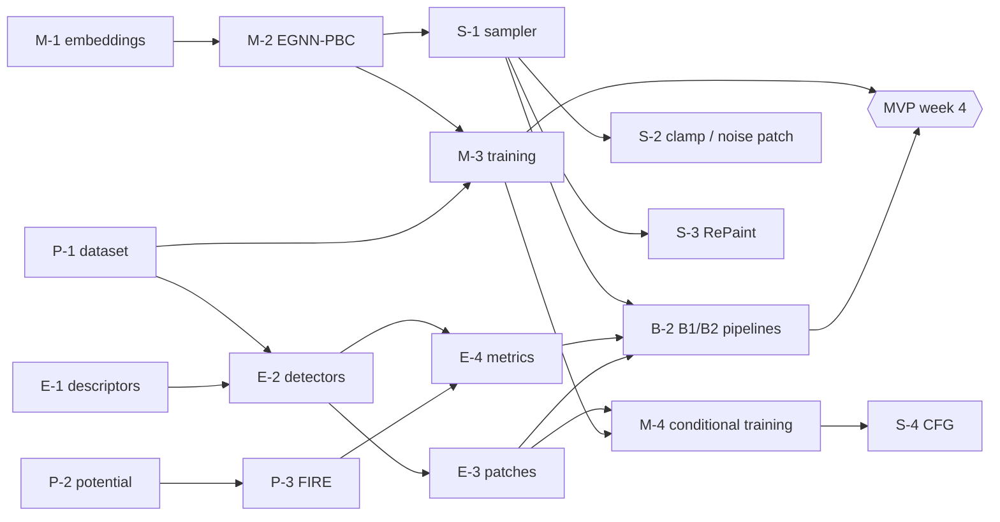

# Implementation plan

This document turns [`PROJECT_PLAN.md`](PROJECT_PLAN.md) into work items. Every module in
`src/glassdiff/` either works already (see §2) or is a stub naming the ticket that owns
it. Every ticket that has an acceptance test has a skipped test file in `tests/`: delete the
`pytestmark = pytest.mark.skip(...)` line when you start the ticket, and the ticket is done
when that file passes.

---

## 1. Conventions (read before writing code)

| Topic | Rule |
|---|---|
| Units | LJ: lengths in σ_AA, energies in ε_AA, time in τ. |
| Shapes | `Structures.pos` [B, N, 2], `types` [B, N] (0 = A, 1 = B), `box` [B, 2]. All structures in a batch have the same N. Write shapes in docstrings. |
| Periodic boundaries | Only `glassdiff.geometry` computes pair vectors (`minimum_image`, `pair_vectors`, `neighbor_list`). Never write `x[i] - x[j]` anywhere else. Positions may leave the box; never wrap inside the model. |
| Labels | Dataset labels use `DefectClass` (0 none, 1 D1−, 2 D1+, 3 D2). Model inputs use `LabelToken` (0 unlabelled, 1 NULL for CFG, then `defect_token(c) = c + 2`). |
| Denoiser interface | `model(s, sigma, pin=None, label=None) -> displacement [B, N, 2]`. The sampler subtracts it. σ-blind models ignore `sigma`. |
| Randomness | Any function that samples takes `generator: torch.Generator | None`. Scripts call `seed_everything(cfg["seed"])`. |
| Precision | Physics code must work in float64 (the tests use it). Build constant tensors in the input's dtype. |
| Configs | YAML in `configs/`, overridden on the command line as `key.sub=value`. Scripts save the resolved config into their run directory. |
| Runs | `make_run_dir(name, cfg)` → `runs/<timestamp>_<name>/` containing `config.yaml`, `git.txt`, logs, checkpoints, samples and `metrics.json`. `runs/` is gitignored; small summary tables and figures go in `results/`. The datasets in `data/` are committed and frozen. |
| Train/test hygiene | Thresholds and patches come from **train** only. Natural-defect references and Task B hosts come from **test** only. Val is for tuning. |
| Style | `ruff check` and `ruff format` (line length 100). Type hints on public functions. |
| Tests | CPU-only and fast in CI. Tests needing LAMMPS, a GPU or the dataset skip themselves when those are missing. |

### Git workflow
* `main` only receives reviewed pull requests; no direct pushes.
* One branch per ticket: `ws<k>/<ticket>-<short-name>` (e.g. `ws1/P-2-ka-potential`).
* Each PR names its ticket, removes that ticket's skip line, and passes CI (ruff + pytest).
  One reviewer from a **different** workstream approves.
* Squash-merge. Keep PRs small (one ticket, ideally < 400 lines).

---

## 2. Implementation status

| Ticket | Status |
|---|---|
| Foundations: `types.py`, `geometry.py`, `utils/` | ✅ done, tested |
| **P-1** dataset generation (`md/lammps_quench.py`, `data/dataset.py`, `scripts/make_dataset.py`) | ✅ done; all four sets generated (DATASET.md §1.8) |
| **P-2** KA potential | ✅ done; matches LAMMPS per-atom energies to 1e-5 |
| **P-3** batched FIRE + `scripts/relax.py` | ✅ done; converges in ~1.5–3k steps; Verlet neighbour-list forces (3.3× faster than dense on CPU, identical results) |
| **E-1** descriptors | ✅ done, tested |
| **E-2** detectors + `scripts/freeze_thresholds.py` | ✅ done; thresholds frozen (`1c8714e00c26` for `ka2d_256`) |
| **E-3** patch library + `scripts/build_patches.py` | ✅ done; 10,545 train patches |
| **E-4** metrics, bootstrap, `scripts/evaluate.py` (incl. floor mode) | ✅ done; diversity/memorization use simple histogram descriptors (could be upgraded) |
| **M-1** embeddings, **M-2** EGNN-PBC | ✅ done; symmetry tests pass (translation incl. wrap, 90° and arbitrary rotation, permutation) |
| **M-3** noise/loss + `scripts/train.py` | ✅ done; CPU smoke run learns (val loss below the predict-zero baseline) |
| **M-4** `RequestSampler` (centre / patch / host modes, CFG dropout) | ✅ done, tested |
| **S-1** sampler, **S-2** clamp / noise patch, **S-3** RePaint, **S-4** pinned label + CFG | ✅ done, tested with an oracle denoiser |
| **B-2** eval requests (Task A and Task B), hand insertion (`baselines.py`, `scripts/hand_insert.py`) | ✅ done |
| **P-4** local melt-quench (`md/local_melt_quench.py`, `scripts/local_melt_quench.py`) | ✅ done; host atoms stay fixed to 1e-12 |
| **M-5** MPNN, **M-6** flat MLP | ✅ done, tested (MPNN verified to lack rotation symmetry) |
| **B-3** `scripts/aggregate_results.py` → summary CSV | ✅ done |
| Figures: `glassdiff/viz.py`, `scripts/plot_samples.py` (glasses or run samples, defects ringed, target and pins marked) | ✅ done |
| End-to-end pipeline test (`tests/test_pipeline.py`) | ✅ runs every script on a tiny synthetic dataset in CI |
| **E-5** report tables (`eval/report.py`; `aggregate_results.py` also writes `summary.md`), training curves (`scripts/plot_training.py`) | ✅ done |
| End-to-end smoke run on real data (CPU) | ✅ `results/cpu_smoke/`: B1, B2, B5, B6 and the floor for D2; a pipeline check, not results |
| B-1 Stage 0 (needs a GPU + the DM2 environment) | ⏳ open |
| S-5 classifier guidance, M-7 NequIP-2D | ⏳ stretch |
| Colab workflow (`notebooks/colab_train.ipynb`): speed test, resumable training (`train.py resume=<run>`, atomic checkpoints), experiment matrix, summary | ✅ ready |
| **GPU training runs** (unconditional EGNN at full size, then conditional) | ⏳ next: run the Colab notebook |

Install and check:

```bash
pip install torch --index-url https://download.pytorch.org/whl/cpu   # or a CUDA build
pip install -e ".[dev]"            # add ",md" for LAMMPS: pip install -e ".[dev,md]"
ruff check src tests scripts && pytest -q
```

---

## 3. Tickets

Workstreams: **WS1** data & physics · **WS2** defects & evaluation · **WS3** models &
training · **WS4** sampling & conditioning · **WS5** baselines, tracking & writing.

### WS1: data & physics
| Ticket | Deliverable | Depends on | Done when | Week |
|---|---|---|---|---|
| **P-1** | `md/lammps_quench.py` (`make_glass`, `passes_quality_gates`), `data/dataset.py` (`load_split`, `save_split`), `scripts/make_dataset.py` with a process pool | — | All four `configs/data/*.yaml` sets generated and passing the quality gates; the same seed gives an identical glass; `meta.json` records the protocol, LAMMPS version, git state and rejections; `pe_atom` comes from LAMMPS `compute pe/atom` | 1 |
| **P-2** | `physics/ka_potential.py` | — | `tests/test_potential.py` passes, including the comparison against LAMMPS energies stored in the dataset | 1–2 |
| **P-3** | `physics/fire.py`, `scripts/relax.py` | P-2 | `tests/test_fire.py` passes; relaxing the dataset's thermal snapshots matches LAMMPS inherent-structure energies within 1e-4 per atom; 256 samples relax in < 1 min on a GPU | 2 |
| **P-4** | `md/local_melt_quench.py` (baseline B6, Task B) | P-1 | Re-melts a disk with the host frozen; success rate and seconds per success logged for D1± and D2 | 5 |

### WS2: defects & evaluation
| Ticket | Deliverable | Depends on | Done when | Week |
|---|---|---|---|---|
| **E-1** | `analysis/descriptors.py` | — | `tests/test_descriptors.py` passes; reproduces the pilot statistics (`docs/pilot/out_*.txt`) within noise on freshly generated glasses | 1–2 |
| **E-2** | `analysis/defects.py`, `scripts/freeze_thresholds.py` | E-1, P-1 | `tests/test_defects.py` passes; train-split rates land in the ranges of DATASET.md §1.5; thresholds frozen with a hash in `meta.json`; `labels` written to every split | 2 |
| **E-3** | `data/patches.py`, `scripts/build_patches.py` | E-2 | Library built from train only; `sample()` returns randomly rotated patches; counts per class reported | 2 |
| **E-4** | `analysis/structure.py`, `eval/metrics.py`, `eval/bootstrap.py`, `scripts/evaluate.py` | E-2, P-3 | `tests/test_bootstrap.py` passes; **floor** (natural train vs natural test) and **ceiling** (hand insertion before relaxation) rows computed for every metric | 2–3 |
| **E-5** | Report tables and figures in `eval/report.py` and `notebooks/figures.ipynb` | E-4, B-3 | The midterm tables are generated from `results/summary.csv` | 4–6 |

### WS3: models & training
| Ticket | Deliverable | Depends on | Done when | Week |
|---|---|---|---|---|
| **M-1** | `models/embeddings.py` (σ Fourier features, species, pin flag, label tokens including NULL) | — | Shape tests; the σ-blind switch removes the σ path | 2 |
| **M-2** | `models/egnn_pbc.py` | M-1 | `tests/test_equivariance.py` passes (translation including wrap-around, 90° rotation, permutation), in float64 | 2 |
| **M-3** | `diffusion/noise.py`, the training loop in `scripts/train.py` (AdamW, EMA, gradient clipping, checkpoints, run directory, val loss) | M-2, P-1 | `tests/test_noise.py` passes; overfits one glass; the unconditional EGNN trains on `ka2d_256` with flat val loss by the end | 2–3 |
| **M-4** | `data/requests.py` `RequestSampler`; conditional training (`configs/train/cond.yaml`) | E-2, E-3, M-3 | Mode, centre and dropout frequencies match the config (unit test); conditional EGNN trained | 6–7 |
| **M-5** | `models/mpnn.py` | M-1 | Shape tests and permutation test; trained at N = 64 and N = 256 | 7–8 |
| **M-6** | `models/mlp.py` | M-1 | Trained at N = 64 | 7–8 |
| M-7 | NequIP-2D wrapper (stretch) | M-3 | — | 9 |

### WS4: sampling & conditioning
| Ticket | Deliverable | Depends on | Done when | Week |
|---|---|---|---|---|
| **S-1** | `diffusion/sampler.py` (`random_init`, `sample`), `scripts/sample.py` | M-2 interface only | `tests/test_sampler.py` passes (the oracle denoiser recovers a known glass); batched; wall-clock time logged | 3 |
| **S-2** | `NoisePatch` (B3) and `Clamp` (B4) in `diffusion/conditioning.py` | S-1, E-3 | Pinned atoms end exactly at their targets (Clamp); unit tests with the oracle | 4–5 |
| **S-3** | `RePaint` (B5) | S-1 | Resampling with jump length matches the RePaint schedule (unit test on the step sequence); the U/j sweep runs | 5 |
| **S-4** | `PinnedLabel` + `CFGDenoiser` | M-4 | w = 0 equals the conditional model; the w sweep runs | 7 |
| S-5 | Classifier guidance (stretch) | M-4 | — | 9 |

### WS5: baselines, tracking & writing
| Ticket | Deliverable | Depends on | Done when | Week |
|---|---|---|---|---|
| **B-1** | Stage 0: the course notebook in `notebooks/stage0_poc.ipynb`, plus `scripts/stage0_dm2_sanity.py` on a GPU | — | Notebook figure reproduced; DM2's pretrained sample g(r) matches its training data (figure in `results/stage0/`) | 1 |
| **B-2** | `data/requests.py` `make_eval_request`; pipelines for B1 (unconditional + filter) and B2 (hand insertion + relax) | S-1, P-3, E-3, E-4 | 256 samples per defect class evaluated end to end, with CIs | 3–4 |
| **B-3** | `scripts/aggregate_results.py` → `results/summary.csv` | E-4 | One row per (task, method, defect, model, seed) with every metric and CI | 3 |
| **B-4** | Midterm report (week 6) and final report (week 9) | all | — | 6, 9 |

---

## 4. Dependency graph and critical path



**Critical path to the MVP:** P-1 → E-2 → E-4 → B-2, alongside M-1 → M-2 → M-3 and S-1.
P-1, E-1, M-1, P-2, B-1 and S-1 (with the oracle) have no blocking dependencies, so all
five people can start in week 1.

---

## 5. Week 1 kickoff (suggested first assignments)

| Person (team assigns) | Start with | Unblocks |
|---|---|---|
| WS1 owner | P-1 (begin from `docs/pilot/pilot_ka2d.py`), then P-2 | everything that needs data |
| WS2 owner | E-1 (port the pilot's descriptors to the `Structures` API) | E-2, metrics |
| WS3 owner | M-1, then M-2 | training |
| WS4 owner | S-1 against the oracle test (needs no trained model) | all sampling |
| WS5 owner | B-1 Stage 0 (find a GPU), then B-3 results layout | midterm reporting |

**MVP definition of done (end of week 4):**
1. `ka2d_256` and `ka2d_64` are generated, labelled with frozen thresholds, and come with
   a patch library.
2. The unconditional EGNN-PBC is trained. After relaxation its samples show no
   crystallization (|Ψ6| < 0.3), fewer than 1% overlapping atoms, and a global g(r) W1
   within 2× the floor.
3. B1 and B2 are evaluated end to end on D1± and D2 with bootstrap CIs, with the floor and
   ceiling rows present.

---

## 6. Running each stage

```bash
# data (WS1, WS2): see docs/DATASET.md §4 for all four sets
python scripts/make_dataset.py      --config configs/data/ka2d_256.yaml workers=4
python scripts/freeze_thresholds.py --config configs/defects/v0.yaml data=data/ka2d_256
python scripts/build_patches.py     --config configs/defects/v0.yaml data=data/ka2d_256

# model (WS3): full size on a GPU; add model_args.hidden=64 max_minutes=60 for a CPU smoke run
python scripts/train.py --config configs/train/uncond.yaml
python scripts/train.py --config configs/train/cond.yaml

# sampling (WS4). Task A: request.mode=centre|patch. Task B: request.mode=host
python scripts/sample.py --config configs/sampler/dm2.yaml     ckpt=runs/<uncond>/ckpt.pt data=data/ka2d_256 defect=D2
python scripts/sample.py --config configs/sampler/repaint.yaml ckpt=runs/<uncond>/ckpt.pt data=data/ka2d_256 defect=D2
python scripts/sample.py --config configs/sampler/cfg.yaml     ckpt=runs/<cond>/ckpt.pt   data=data/ka2d_256 defect=D2 request.mode=host

# baseline B2 (no model)
python scripts/hand_insert.py --config configs/eval/default.yaml data=data/ka2d_256 defect=D2

# relaxation + metrics, for every run above (WS2, WS5)
python scripts/relax.py    --config configs/eval/default.yaml run=runs/<run>
python scripts/evaluate.py --config configs/eval/default.yaml run=runs/<run> data=data/ka2d_256 [also_unrelaxed=true]
python scripts/evaluate.py --config configs/eval/default.yaml floor=true defect=D2 data=data/ka2d_256
```

Every script accepts dotted overrides (`key.sub=value`) and `threads=` / `device=`.
On CPU, keep `threads` at or below the number of free cores: tiny tensors get much slower
when threads compete.

---

## 7. Decisions still open (from PROJECT_PLAN.md §10)

These don't block week 1; settle them at the first team meeting.

1. Task B (host-conditioned inpainting) as the headline evaluation? The scaffold supports
   both tasks (`mode: host` in the request configs).
2. Training on inherent structures (default in the configs) or on thermal snapshots?
3. A σ-aware main model (default `sigma_aware: true`) or σ-blind as in DM2?
4. GPU access: this decides how many seeds we run.
5. The Stage 0 course notebook: commit it to `notebooks/`.
